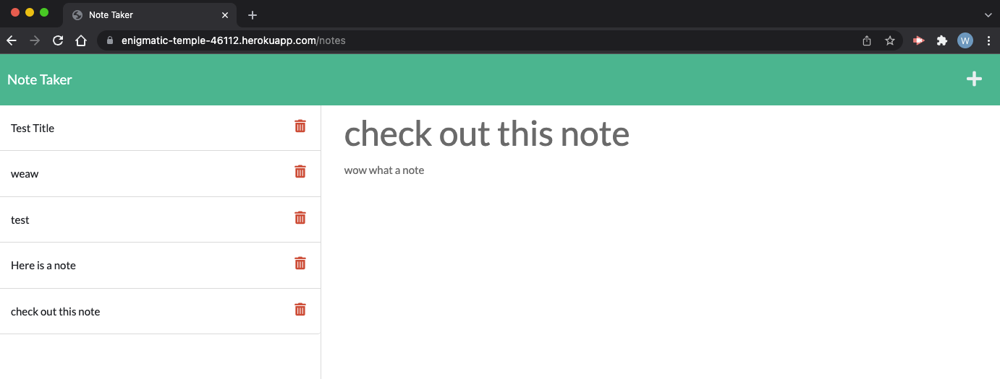

# will-note-taker App

## Deployed Application
[Click here to go to deployed Application](https://enigmatic-temple-46112.herokuapp.com/)

## Description 
A simple notetaker app created using the express package on Node.js.
Given starter code then added apirRoutes, htmlRoutes, and a server.js file to operate the application. 
starter code forked from [here](https://github.com/coding-boot-camp/miniature-eureka)

## Installation
Copy the code and run NPM install to run on local machine,

## Usage
Click on the deployed link and take some notes! Once you type a title and body a save icon will appear in the upper right corner to add it to your saved notes. 
The red trash can deletes the note. 
Click the plus in the upper right hand corner to create a new note. 

## Image of deployed application

## License 
Using the MIT License